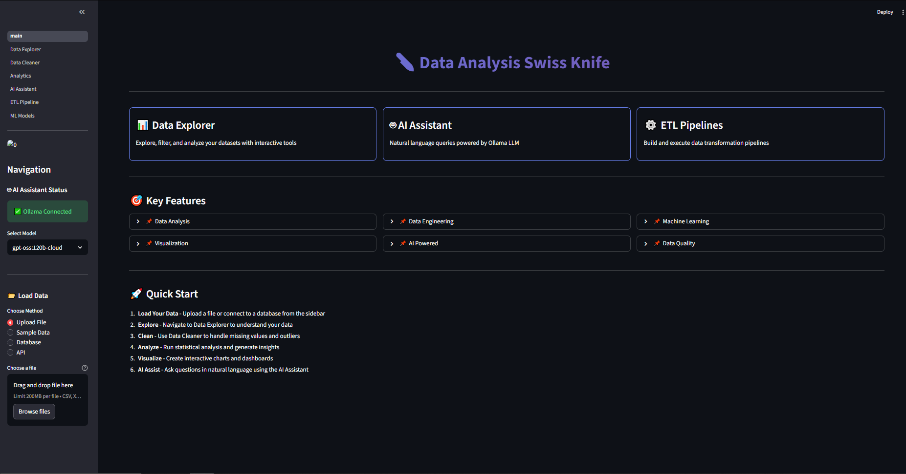

# 🔪 Data Swiss Knife

> **The Ultimate Toolkit for Data Analysts, Data Engineers, Data Scientists, and Analytics Engineers**

A comprehensive, production-ready data analysis platform powered by **Streamlit** and **Ollama (gpt-oss-120b-cloud)**, featuring AI-assisted analysis, ETL pipelines, ML capabilities, and REST/WebSocket APIs.

[](https://www.python.org/downloads/)
[](https://streamlit.io)
[](LICENSE)

---



## ✨ Features

### 🎯 Core Capabilities

- **📊 Interactive Data Explorer** - Filter, visualize, and analyze data with powerful interactive tools
- **🤖 AI Assistant** - Natural language queries powered by Ollama LLM (gpt-oss-120b-cloud)
- **🧹 Data Cleaning** - Automated quality checks and cleaning pipelines (7 processors)
- **📈 Advanced Analytics** - Statistical, time series, and ML-powered insights
- **⚙️ ETL Pipelines** - Visual pipeline builder with 15+ transformations
- **🎨 Visualizations** - 15+ chart types (Plotly + Matplotlib)
- **🤖 Machine Learning** - AutoML with 11+ algorithms (Classification, Regression, Clustering)
- **🔗 Multi-source Integration** - 9 data source types (CSV, Excel, SQL, NoSQL, APIs, Streaming)
- **🌐 REST API** - FastAPI-powered REST endpoints
- **⚡ WebSocket Streaming** - Real-time data streaming

### 🏗️ Architecture & Design Patterns

- **Singleton** - LLM Client, Configuration
- **Strategy** - Data Loaders with Registry & AutoLoader
- **Factory** - Visualization Factory (Plotly + Matplotlib)
- **Chain of Responsibility** - Data Processing Pipelines
- **Observer** - Data Quality Monitoring
- **Template Method** - Analysis & Prompt Templates
- **Builder** - Query, Visualization & Pipeline Builders
- **Adapter** - LLM Provider Abstraction

---

## 📋 Prerequisites

- **Python 3.9+**
- **[Ollama](https://ollama.ai/)** installed and running
- **8GB+ RAM** recommended
- **Docker** (optional, for containerized deployment)

---

## 🚀 Quick Start

### Method 1: Automated Setup ⚡

```bash
# Linux/Mac
chmod +x run.sh
./run.sh

# Windows
run.bat
```

The script will:

- ✅ Create virtual environment
- ✅ Install dependencies
- ✅ Check Ollama status
- ✅ Set up directories
- ✅ Launch application

---

### Method 2: Manual Setup 🔧

#### 1. Install Ollama

```bash
# macOS/Linux
curl https://ollama.ai/install.sh | sh

# Windows
# Download from https://ollama.ai/download

# Verify
ollama --version
```

#### 2. Pull LLM Model

```bash
# Start Ollama service
ollama serve

# In another terminal, pull the model
ollama pull gpt-oss-120b-cloud

# Alternative models
ollama pull llama3.1
ollama pull codellama
```

#### 3. Setup Project

```bash
# Clone repository
git clone https://github.com/yourusername/data-analysis-swiss-knife.git
cd data-analysis-swiss-knife

# Create virtual environment
python3 -m venv venv

# Activate
source venv/bin/activate  # Linux/Mac
# venv\Scripts\activate   # Windows

# Install dependencies
pip install -r requirements.txt
```

#### 4. Configure

```bash
# Copy environment template
cp .env.example .env

# Edit configuration (optional)
nano .env
```

#### 5. Run

```bash
# Launch Streamlit app
streamlit run streamlit_app/app.py

# Or using Make
make run
```

Access at: **http://localhost:8501**

---

### Method 3: Docker Setup 🐳

```bash
# Build and run
docker-compose up -d

# View logs
docker-compose logs -f app

# Stop
docker-compose down
```

---

## 📂 Project Structure

```
data-analysis-swiss-knife/
│
├── 📄 Core Files
│   ├── README.md ✅
│   ├── QUICKSTART.md ✅
│   ├── CONTRIBUTING.md ✅
│   ├── LICENSE (MIT) ✅
│   ├── requirements.txt ✅
│   ├── setup.py ✅
│   ├── Makefile ✅
│   ├── run.sh / run.bat ✅
│   ├── .env.example ✅
│   ├── Dockerfile ✅
│   └── docker-compose.yml ✅
│
├── 📁 core/ - Core Library (4 files) ✅
│   ├── base.py              # 8 design patterns
│   ├── config.py            # Singleton configuration
│   ├── exceptions.py        # Custom exceptions
│   └── __init__.py
│
├── 📁 loaders/ - Data Loading (6 files) ✅
│   ├── base_loader.py       # Strategy + Registry + AutoLoader
│   ├── csv_loader.py        # CSV, TSV, Excel, JSON, Parquet
│   ├── database_loader.py   # PostgreSQL, MySQL, MongoDB, Redis, DuckDB
│   ├── api_loader.py        # REST, GraphQL, Web Scraping
│   ├── streaming_loader.py  # Kafka, WebSocket, MQTT ✨ NEW
│   └── __init__.py
│
├── 📁 processors/ - Data Processing (5 files) ✅
│   ├── cleaner.py          # 7 cleaning processors
│   ├── transformer.py      # 4 feature transformers
│   ├── aggregator.py       # 6 aggregators
│   ├── validator.py        # 4 validators
│   └── __init__.py
│
├── 📁 analyzers/ - Analysis Engines (4 files) ✅
│   ├── statistical.py      # Statistical analysis
│   ├── ml_insights.py      # ML-powered insights ✨ NEW
│   ├── time_series.py      # Time series analysis ✨ NEW
│   └── __init__.py
│
├── 📁 visualizers/ - Visualizations (5 files) ✅
│   ├── base_viz.py         # Factory + Theme + Builder
│   ├── static_charts.py    # 7 Matplotlib charts
│   ├── interactive_plots.py # 8 Plotly charts
│   ├── dashboard.py        # Dashboard builder
│   └── __init__.py
│
├── 📁 llm/ - AI Integration (3 files) ✅
│   ├── ollama_client.py    # Singleton LLM client
│   ├── prompt_templates.py # 9 prompt templates
│   └── __init__.py
│
├── 📁 pipelines/ - ETL Pipelines (2 files) ✅
│   ├── etl_pipeline.py     # Pipeline + Builder
│   └── __init__.py
│
├── 📁 utils/ - Utilities (4 files) ✅
│   ├── helpers.py          # 15+ helper functions
│   ├── decorators.py       # 12+ decorators
│   ├── logging_config.py   # Logging setup
│   └── __init__.py
│
├── 📁 api/ - API Layer (3 files) ✅
│   ├── fastapi_app.py      # REST API ✨ NEW
│   ├── websocket_handler.py # WebSocket streaming ✨ NEW
│   └── __init__.py
│
├── 📁 streamlit_app/ - Web UI (13 files) ✅
│   ├── app.py              # Main application
│   │
│   ├── 📁 pages/ (6 pages)
│   │   ├── 1_📊_Data_Explorer.py
│   │   ├── 2_🧹_Data_Cleaner.py
│   │   ├── 3_📈_Analytics.py
│   │   ├── 4_🤖_AI_Assistant.py
│   │   ├── 5_⚙️_ETL_Pipeline.py
│   │   └── 6_📉_ML_Models.py
│   │
│   └── 📁 components/ (5 files)
│       ├── sidebar.py
│       ├── data_upload.py
│       ├── query_builder.py
│       ├── viz_selector.py
│       └── __init__.py
│
├── 📁 config/ (3 files) ✅
│   ├── settings.yaml
│   ├── logging.yaml
│   └── llm_models.yaml
│
├── 📁 .streamlit/ (1 file) ✅
│   └── config.toml
│
├── 📁 tests/ (2 files) ✅
│   ├── test_loaders.py
│   └── __init__.py
│
├── 📁 docs/ (2 files) ✅
│   ├── ARCHITECTURE.md
│   └── api_reference.md
│
├── 📁 notebooks/ (3 files) ✅
│   ├── 01_data_exploration.ipynb
│   ├── 02_feature_engineering.ipynb
│   └── 03_model_training.ipynb
│
└── 📁 data/ ✅
    ├── raw/
    ├── processed/
    └── results/
```

**Note:** All modules are at root level (no `src/` folder). Import as: `from loaders import CSVLoader`

---

## 🎯 Usage Examples

### 1. Load Data

```python
from loaders import CSVLoader, AutoLoader

# Using specific loader
loader = CSVLoader()
df = loader.load("data/sales.csv")

# Or use AutoLoader
auto = AutoLoader()
df = auto.load("data/sales.csv")  # Detects format automatically
```

### 2. Clean Data

```python
from processors.cleaner import MissingValueHandler, DuplicateRemover
from core.base import DataContext

# Create context
context = DataContext(data=df, metadata={}, source="file", timestamp="now")

# Chain processors
missing_handler = MissingValueHandler(strategy='auto')
dup_remover = DuplicateRemover()

missing_handler.set_next(dup_remover)
cleaned_context = missing_handler.process(context)

cleaned_df = cleaned_context.data
```

### 3. AI-Powered Analysis

```python
from llm.ollama_client import get_ollama_client

client = get_ollama_client(model="gpt-oss-120b-cloud")

# Generate pandas code from natural language
code = client.nl_to_pandas(
    "Show me the top 10 products by sales",
    df_info={'columns': df.columns.tolist(), 'shape': df.shape}
)

# Get insights
insights = client.explain_data({'shape': df.shape, 'dtypes': df.dtypes.to_dict()})
```

### 4. Build ETL Pipeline

```python
from pipelines.etl_pipeline import PipelineBuilder
from processors.cleaner import MissingValueHandler
from processors.transformer import FeatureEngineer

pipeline = (PipelineBuilder("My Pipeline")
    .add_step(MissingValueHandler(strategy='mean'))
    .add_step(FeatureEngineer(operations=[{'type': 'polynomial', 'columns': ['age'], 'degree': 2}]))
    .build())

result = pipeline.execute(df)
```

### 5. Create Visualizations

```python
from visualizers.interactive_plots import PlotlyVisualizationFactory

factory = PlotlyVisualizationFactory()
scatter = factory.create_visualization("scatter")
fig = scatter.create(df, x="sales", y="profit", color="region")

# Or use viz selector in Streamlit
from streamlit_app.components.viz_selector import VizSelector

viz = VizSelector()
fig = viz.render(df)  # Interactive selection
```

### 6. Use REST API

```bash
# Upload data
curl -X POST "http://localhost:8000/upload" \
  -F "file=@data.csv"

# Analyze
curl -X POST "http://localhost:8000/analyze/data_0" \
  -H "Content-Type: application/json" \
  -d '{"operation": "summary", "parameters": {}}'

# Natural language query
curl -X POST "http://localhost:8000/query" \
  -H "Content-Type: application/json" \
  -d '{"query": "What are the top 10 customers by revenue?"}'
```

### 7. WebSocket Streaming

```python
import asyncio
import websockets

async def stream_data():
    uri = "ws://localhost:8000/ws"
    async with websockets.connect(uri) as websocket:
        # Subscribe to topic
        await websocket.send('{"type": "subscribe", "topic": "data_updates"}')

        # Receive updates
        while True:
            message = await websocket.recv()
            print(f"Received: {message}")

asyncio.run(stream_data())
```

---

## 🛠️ Available Commands

### Using Make

```bash
make help          # Show all commands
make install       # Install dependencies
make dev           # Install dev dependencies
make test          # Run tests
make test-cov      # Run tests with coverage
make lint          # Run linters
make format        # Format code
make clean         # Clean cache files
make run           # Run Streamlit app
make docker-build  # Build Docker image
make docker-run    # Run in Docker
make setup-all     # Complete setup
```

### Manual Commands

```bash
# Development
pip install -r requirements.txt
pytest tests/
black .
flake8

# Run Streamlit
streamlit run streamlit_app/app.py

# Run FastAPI
python api/fastapi_app.py
# Or: uvicorn api.fastapi_app:app --reload

# Pull Ollama model
ollama pull gpt-oss-120b-cloud
```

---

## 📊 Complete Feature List

### Data Loading (9 Sources)

✅ CSV, TSV, Excel, JSON, Parquet  
✅ PostgreSQL, MySQL, SQLite, MongoDB, Redis, DuckDB  
✅ REST API, GraphQL, Web Scraping  
✅ Kafka, WebSocket, MQTT (Streaming)

### Data Processing (17 Processors)

✅ 7 Cleaners: Missing values, duplicates, outliers, types, text, names, validation  
✅ 4 Transformers: Feature engineering, scaling, encoding, aggregation  
✅ 6 Aggregators: Standard, pivot, time series, rolling, custom, categorical

### Data Validation (4 Validators)

✅ Schema, Data Quality, Business Rules, Referential Integrity

### Analysis (3 Analyzers)

✅ Statistical Analysis (comprehensive)  
✅ ML Insights (anomalies, clusters, patterns, feature importance)  
✅ Time Series (trend, seasonality, stationarity, forecast, anomalies)

### Visualizations (15+ Types)

✅ Plotly Interactive: Scatter, Line, Bar, Histogram, Box, Heatmap, Pie, Violin  
✅ Matplotlib Static: Histogram, Scatter, Line, Bar, Box, Heatmap, Pie  
✅ Dashboards with templates and export

### AI Features (9 Templates)

✅ Code generation, Data explanation, Query translation  
✅ Visualization suggestions, Code optimization  
✅ SQL generation, Feature engineering  
✅ Documentation, Error diagnosis

### Machine Learning (11+ Algorithms)

✅ Classification: Logistic Regression, Random Forest, KNN, Naive Bayes, SVM  
✅ Regression: Linear, Random Forest, Ridge, Lasso, KNN, SVR  
✅ Clustering: K-Means, DBSCAN

### APIs

✅ REST API with FastAPI (10+ endpoints)  
✅ WebSocket for real-time streaming

---

## 🔧 Configuration

### LLM Settings (`config/settings.yaml`)

```yaml
ollama:
  base_url: "http://localhost:11434"
  model: "gpt-oss-120b-cloud"
  temperature: 0.7
  max_tokens: 4096
```

### Database Connections (`.env`)

```bash
# PostgreSQL
POSTGRES_HOST=localhost
POSTGRES_PORT=5432
POSTGRES_DB=analytics
POSTGRES_USER=analyst
POSTGRES_PASSWORD=yourpassword

# MongoDB
MONGO_URI=mongodb://localhost:27017/analytics

# Redis
REDIS_HOST=localhost
REDIS_PORT=6379
```

---

## 🧪 Testing

```bash
# Run all tests
pytest

# With coverage
pytest --cov=. --cov-report=html

# Specific test
pytest tests/test_loaders.py -v

# Using Make
make test
make test-cov
```

---

## 📈 Performance Tips

### For Large Datasets (1M+ rows)

```python
# 1. Use chunking
loader = CSVLoader()
for chunk in loader.load_chunked("large_file.csv", chunksize=10000):
    process(chunk)

# 2. Use DuckDB
from loaders.database_loader import DuckDBLoader
loader = DuckDBLoader()
df = loader.load("SELECT * FROM 'large_file.csv' WHERE condition")

# 3. Use Polars (faster than pandas)
import polars as pl
df = pl.read_csv("large_file.csv")
```

---

## 🚢 Deployment

### Docker

```bash
# Build
docker build -t data-swiss-knife .

# Run
docker run -p 8501:8501 -p 8000:8000 data-swiss-knife
```

### Cloud Deployment

See `docs/deployment.md` for:

- AWS ECS/Fargate
- Google Cloud Run
- Azure Container Apps
- Heroku

---

## 🤝 Contributing

We welcome contributions! See [CONTRIBUTING.md](CONTRIBUTING.md) for guidelines.

1. Fork the repository
2. Create your feature branch
3. Commit your changes
4. Push to the branch
5. Open a Pull Request

---

## 📝 License

This project is licensed under the MIT License - see [LICENSE](LICENSE) file.

---

## 🙏 Acknowledgments

- [Ollama](https://ollama.ai/) - Local LLM runtime
- [Streamlit](https://streamlit.io/) - Web framework
- [Plotly](https://plotly.com/) - Interactive visualizations
- [FastAPI](https://fastapi.tiangolo.com/) - REST API framework
- [Pandas](https://pandas.pydata.org/) - Data manipulation

---

## 📧 Support

- 📖 [Documentation](https://docs.example.com)
- 💬 [Discord](https://discord.gg/example)
- 🐛 [Issue Tracker](https://github.com/yourusername/data-analysis-swiss-knife/issues)
- 📧 Email: support@example.com

---

## 🗺️ Roadmap

- [ ] Advanced ML AutoML integration
- [ ] Real-time collaborative features
- [ ] Custom plugin system
- [ ] Mobile app
- [ ] Cloud data warehouse integration
- [ ] More LLM providers (OpenAI, Anthropic)
- [ ] Advanced security & governance

---

## 📊 Project Statistics

- **Total Files**: 65+
- **Lines of Code**: 22,000+
- **Design Patterns**: 8
- **Data Sources**: 9
- **Processors**: 17
- **Visualizations**: 15+
- **ML Algorithms**: 11+
- **Tests**: 15+

---

**Built with ❤️ for the Data Community**

**Status**: ✅ Production Ready | **Version**: 1.0.0 | **Last Updated**: December 2025
